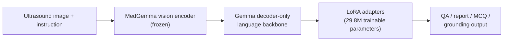
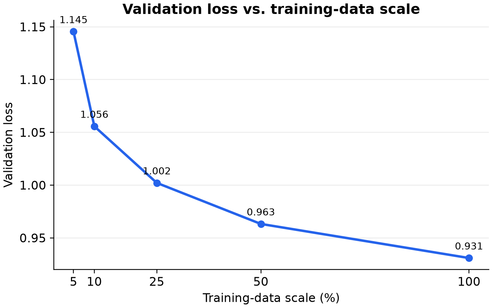
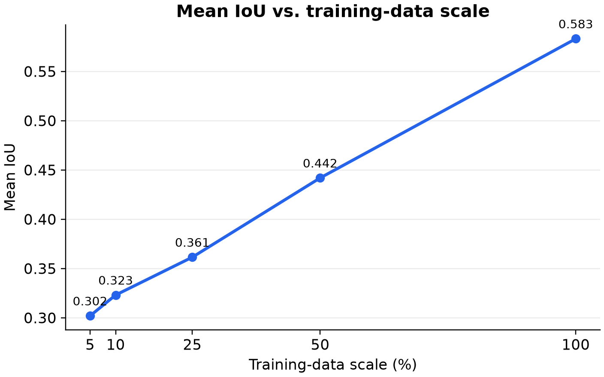
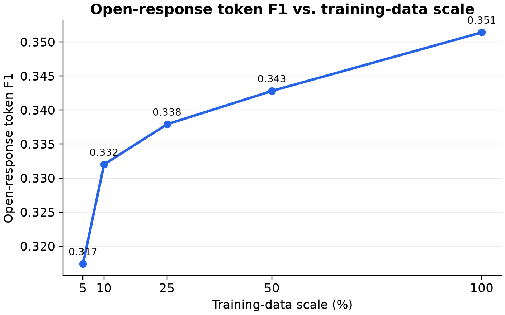
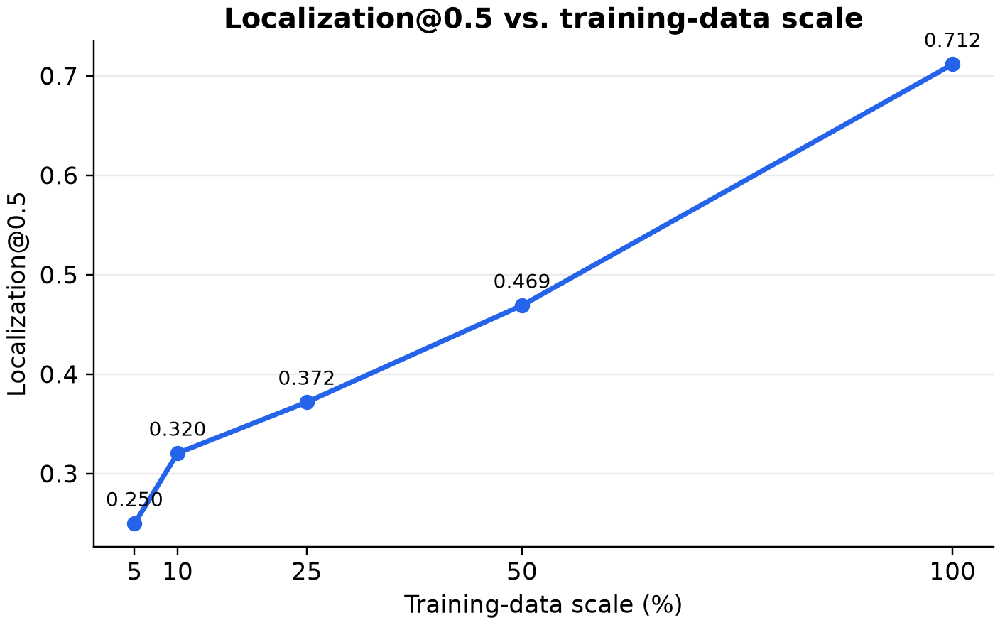

# SonoMed-VLM

**Parameter-efficient domain adaptation of MedGemma 1.5 4B for ultrasound understanding and visual grounding.**

SonoMed-VLM fine-tunes [`google/medgemma-1.5-4b-it`](https://huggingface.co/google/medgemma-1.5-4b-it) on [SonoInstruct](https://huggingface.co/datasets/Ssdaizi/SonoInstruct) with BF16 LoRA supervised fine-tuning. The project includes deterministic image-group-safe splits, assistant-only loss masking, multi-GPU training, raw-output-preserving evaluation, and a controlled 5%→100% data-scaling study.

> Research software only. SonoMed-VLM is not a medical device, is not approved for diagnosis or treatment, and must not be used for clinical decisions without independent validation and appropriate regulatory authorization.

## Highlights

- **93.5% semantic-choice accuracy** on 4,905 MCQs (format-normalized choice resolution)
- **91.5% MCQ option-text accuracy**, reported separately from 25.2% strict label accuracy
- **0.583 mean IoU / 71.2% Localization@0.5** for ultrasound visual grounding
- **6.5× higher mean IoU** than untouched MedGemma (0.583 vs. 0.089)
- **190,625 training examples** with a controlled 5%, 10%, 25%, 50%, and 100% scaling study
- **2.02× training throughput** on 4× RTX PRO 6000 Blackwell versus 4× A100 in the same 50-step benchmark

## Overview

The pipeline adapts the language backbone while keeping the MedGemma vision tower frozen. Rank-16 LoRA adapters are injected into 238 decoder projection modules (`q/k/v/o`, gate, up, and down projections), producing 29.8M trainable parameters. Training uses one epoch, cosine learning-rate scheduling, gradient checkpointing, and an effective batch size of eight across four GPUs.



## Key results

All adapted models were evaluated on the same 10,098-example held-out split. Values below are from the corrected evaluator; the grounding parser supports SonoInstruct's `[0,1000]` box convention.

| Scale | Train examples | Val loss | MCQ option-text acc | Open F1 | Mean IoU | Loc@0.5 |
|---:|---:|---:|---:|---:|---:|---:|
| 5% | 9,379 | 1.1454 | 84.57% | 0.3174 | 0.3020 | 24.96% |
| 10% | 19,035 | 1.0557 | 89.22% | 0.3320 | 0.3231 | 32.04% |
| 25% | 47,860 | 1.0021 | 90.62% | 0.3379 | 0.3615 | 37.17% |
| 50% | 95,544 | 0.9632 | 91.27% | 0.3428 | 0.4419 | 46.90% |
| **100%** | **190,625** | **0.9309** | **91.54%** | **0.3514** | **0.5831** | **71.15%** |

The final 100% run reached train loss **1.0020** and validation loss **0.9309**.

### Base MedGemma vs. 100% LoRA

| Metric | Base MedGemma | 100% LoRA |
|---|---:|---:|
| Strict MCQ label accuracy | 21.94% | 25.22% |
| MCQ option-text accuracy | 0.67% | 91.54% |
| MCQ semantic-choice accuracy | 17.59% | **93.52%** |
| Open-response token F1 | 0.2256 | **0.3514** |
| Open-response ROUGE-L | 0.1509 | **0.2406** |
| Detection valid-box rate | 24.78% | **100.00%** |
| Visual-grounding mean IoU | 0.0894 | **0.5831** |
| Localization@0.5 | 5.31% | **71.15%** |

**MCQ metric nuance.** The fine-tuned model frequently emits the correct option text with an inconsistent symbolic prefix—for example, `A: Kidney` when Kidney is option B. Therefore, 91.54% is specifically **option-text accuracy**, not standard label accuracy. Semantic-choice accuracy resolves a unique question-specific option phrase first and otherwise maps a valid label through that question's choices; unresolved outputs count as incorrect. Strict label accuracy and the 70.15% label/text contradiction rate remain visible rather than being silently reinterpreted.

## Data-scaling figures

| Validation | Grounding |
|---|---|
|  |  |
|  |  |

These are single deterministic runs per scale; no uncertainty intervals were estimated. Machine-readable values are in [`results/scaling_results.csv`](results/scaling_results.csv) and [`results/scaling_results.json`](results/scaling_results.json).

## Dataset and leakage safeguards

SonoInstruct contains ultrasound understanding, knowledge, report-generation, and grounding instructions. The repository does **not** redistribute its images or text.

The manifest builder hashes original image bytes and constructs connected components across every record sharing an image. Entire components—not flattened QA rows—are assigned to train or validation, preventing image leakage. The 5%→100% subsets are drawn from one seeded component ordering and are strictly nested. Each manifest stores only identifiers and source locators; content is reloaded from the authorized dataset copy.

## Evaluation tasks and metrics

- **MCQ:** strict label accuracy, option-text accuracy, semantic-choice accuracy, validity, label/text consistency, and contradiction rate
- **QA and open response:** normalized exact match, token F1, and ROUGE-L F1
- **Visual grounding:** valid/invalid box rate, mean IoU, and Localization@0.5
- **Auditability:** prompts, references, raw generations, parsed predictions, settings, and grouped metadata are retained locally for offline rescoring

Lexical generation scores are similarity measures, not measures of clinical correctness. See [`docs/EVALUATION.md`](docs/EVALUATION.md) for the exact parsing and aggregation protocol.

## Hardware benchmark

The same MedGemma/LoRA workload, fixed subset, effective batch size eight, and 50 optimizer steps were used on one node per platform.

| Hardware | GPUs | Examples/sec | Relative throughput |
|---|---:|---:|---:|
| NVIDIA A100 | 4 | 1.464 | 1.00× |
| NVIDIA RTX PRO 6000 Blackwell | 4 | 2.959 | **2.02×** |

This is a controlled system benchmark, not a claim of a custom Blackwell kernel. The workload already used fused BF16 attention and fused AdamW in the tested stack.

## Quick start

### 1. Install

Python 3.11 or 3.12 and a CUDA-compatible PyTorch build are recommended.

```bash
git clone https://github.com/jxia622/SonoMed-VLM.git
cd SonoMed-VLM
python -m venv .venv
source .venv/bin/activate
python -m pip install --upgrade pip
python -m pip install -e '.[dev]'
```

Accept the gated MedGemma terms, authenticate with `hf auth login`, and obtain SonoInstruct separately. Configure storage with environment variables; never place tokens in YAML or source files.

```bash
export SONOMED_PROJECT_ROOT="$PWD"
export SONOINSTRUCT_ROOT="/path/to/SonoInstruct"
export SONOMED_OUTPUT_ROOT="/path/to/sonomed-outputs"
export HF_HOME="/path/to/huggingface-cache"
```

### 2. Inspect data and build manifests

```bash
python scripts/inspect_dataset.py --data-root "$SONOINSTRUCT_ROOT"
python scripts/build_manifests.py --data-root "$SONOINSTRUCT_ROOT"
python scripts/validate_data.py --data-root "$SONOINSTRUCT_ROOT"
```

### 3. Load the released adapter

```bash
python examples/inference.py ultrasound.png \
  --prompt "Describe the visible anatomy and findings."
```

The script loads the gated MedGemma base model separately, then applies the LoRA adapter from `jxia622/SonoMed-VLM-MedGemma-1.5-4B-LoRA`.

## Training

The final configuration is pinned in [`configs/rtx6k_train_100pct.yaml`](configs/rtx6k_train_100pct.yaml). Every scale starts independently from the same MedGemma revision; no adapter is continued across scales.

```bash
torchrun --standalone --nproc_per_node=4 \
  scripts/train.py --config configs/rtx6k_train_100pct.yaml
```

Important controls include seed 42, assistant-only loss, per-device batch 1, gradient accumulation 2 on four GPUs, rank 16, alpha 32, dropout 0.05, frozen vision/projector parameters, AdamW, a `1e-4` learning rate, and cosine scheduling.

## Evaluation

Generate and score a trained adapter:

```bash
torchrun --standalone --nproc_per_node=4 \
  scripts/baseline_eval.py \
  --config configs/rtx6k_eval_100pct.yaml \
  --adapter "$SONOMED_OUTPUT_ROOT/train_100pct_rtx6k/final_adapter"
```

Re-score existing raw predictions without GPU inference:

```bash
python scripts/evaluate.py \
  --predictions /path/to/eval_predictions.jsonl \
  --output-dir /path/to/corrected-evaluation
```

## Repository structure

```text
configs/                 reproducible training and evaluation configurations
data/manifests/          generated locally; dataset content is never committed
docs/                    data, training, evaluation, and release details
examples/                minimal adapter inference
results/                 curated aggregate results (no raw predictions)
scripts/                 manifest, training, evaluation, and plotting entry points
slurm/                   portable examples for single- and multi-GPU Slurm jobs
src/sonomed_vlm/         package code
tests/                   CPU tests plus marked gated/GPU integration tests
```

## Reproducibility

- MedGemma revision: `91850547d9f0b2fdd21aa7c5f4f3d1a8a52c243b`
- Dataset split seed: `42`
- Validation examples: `10,098`
- Image-group-connected, leakage-safe nested manifests
- Deterministic generation (`do_sample=false`)
- Resolved configs, environment metadata, architecture reports, losses, throughput, and compute accounting saved per run
- Full CPU suite: `41 passed`, with one expected gated/GPU test skipped at release validation

## Limitations

- Evaluation uses one held-out SonoInstruct split and does not establish external clinical validity or generalization across institutions, devices, demographics, or acquisition protocols.
- Only one deterministic run was completed per scale; variance across seeds was not measured.
- MCQ label binding remains weak despite high semantic-choice and option-text accuracy.
- ROUGE-L and token F1 cannot assess factual or clinical safety.
- Grounding boxes are evaluated after mathematically equivalent normalization from SonoInstruct's `[0,1000]` coordinates.
- Outputs may be incorrect, incomplete, biased, or unsafe. Expert review is mandatory.

## License and attribution

Project code is Apache-2.0 licensed; see [`LICENSE`](LICENSE). MedGemma is an open-weight model governed by the [Health AI Developer Foundations Terms of Use](https://developers.google.com/health-ai-developer-foundations/terms) and [Prohibited Use Policy](https://developers.google.com/health-ai-developer-foundations/prohibited-use-policy). SonoInstruct is published under Apache-2.0. See [`THIRD_PARTY_NOTICES.md`](THIRD_PARTY_NOTICES.md).

The LoRA adapter is a MedGemma model derivative and is distributed separately under the HAI-DEF terms. Neither MedGemma base weights nor SonoInstruct data are included here.

## Citation

```bibtex
@software{xia2026sonomedvlm,
  author  = {Jack Xia},
  title   = {SonoMed-VLM: Parameter-Efficient Ultrasound Domain Adaptation of MedGemma},
  year    = {2026},
  url     = {https://github.com/jxia622/SonoMed-VLM},
  version = {0.1.0}
}
```
