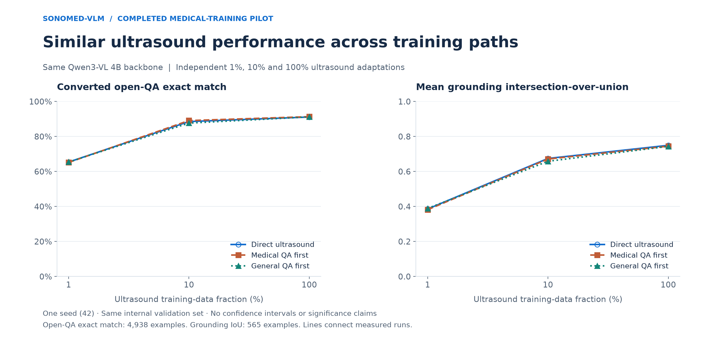
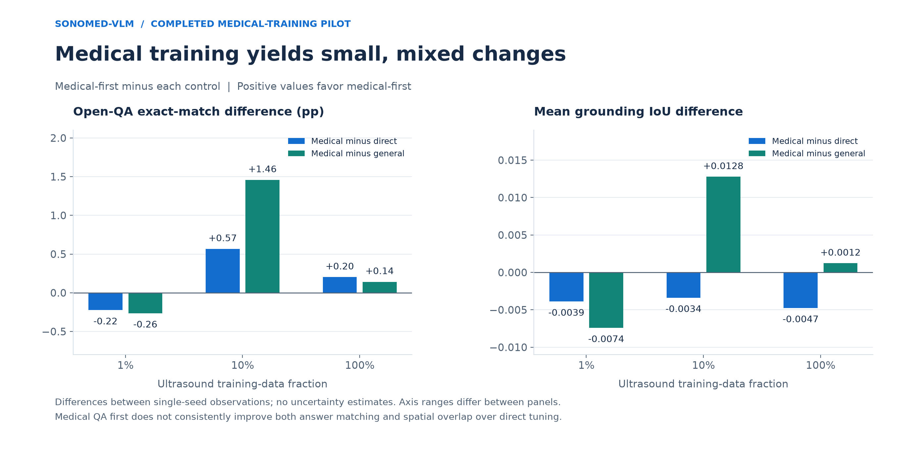
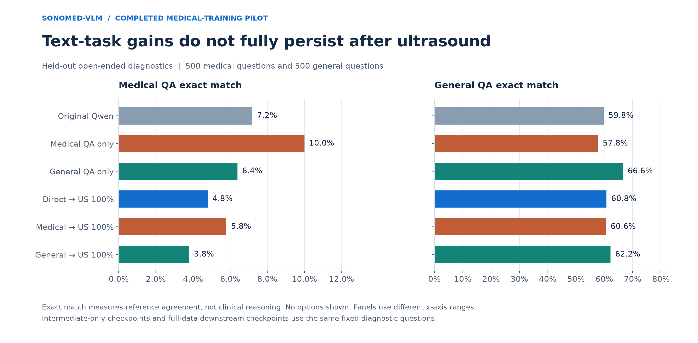

# Does additional medical instruction tuning help ultrasound adaptation?

This experiment tests **additional** clinical QA training, starting from the same
`Qwen/Qwen3-VL-4B-Instruct` checkpoint. It does not assume Qwen lacks medical knowledge,
and does not reproduce MedGemma's pretraining. This is decoder LoRA intermediate
instruction tuning, not full-parameter continued pretraining.

## Completed results · 30 September 2026

All three arm bundles and the final integrity/aggregation job completed successfully.
The summary validates **nine downstream checkpoints × three evaluation domains = 27
evaluations**, plus **six original/intermediate diagnostic evaluations**. This is a
**single-seed pilot (42)**; no seed-variance estimate or significance claim is available.

**Finding:** Additional MedQA instruction tuning does not consistently improve
ultrasound adaptation over direct tuning under this recipe. Medical-first has higher
converted open-QA exact match at 10% and 100%, but lower mean grounding IoU at all three
fractions. Relative to the general-QA control, medical-first is better on both of
these metrics at 10% and 100%, and worse at 1%. These observations do not establish
that medical training is generally ineffective or that the model is overfitting.

[Full aggregate JSON](../results/medical_transfer_pilot/results.json) ·
[All 33 evaluations as CSV](../results/medical_transfer_pilot/evaluation_metrics.csv) ·
[Source hashes and job provenance](../results/medical_transfer_pilot/provenance.json)



### All nine ultrasound comparisons

| Ultrasound data | Training path | Open-QA EM | Open-QA F1 | Ordinary QA F1 | Mean IoU | Loc@0.5 |
|---|---|---:|---:|---:|---:|---:|
| 1% | Direct | 65.39% | 0.6650 | 0.2743 | 0.3857 | 36.11% |
| 1% | Medical QA first | 65.17% | 0.6628 | 0.2736 | 0.3818 | 35.58% |
| 1% | General QA first | 65.43% | 0.6649 | 0.2756 | 0.3892 | 37.52% |
| 10% | Direct | 88.54% | 0.8994 | 0.3233 | 0.6745 | 81.77% |
| 10% | Medical QA first | 89.10% | 0.9048 | 0.3231 | 0.6712 | 81.59% |
| 10% | General QA first | 87.65% | 0.8906 | 0.3211 | 0.6584 | 80.18% |
| 100% | Direct | 91.13% | 0.9261 | 0.3511 | 0.7496 | 87.08% |
| 100% | Medical QA first | 91.33% | 0.9283 | 0.3506 | 0.7449 | 87.43% |
| 100% | General QA first | 91.19% | 0.9277 | 0.3504 | 0.7437 | 86.55% |

The same 9,964 examples are used throughout: 4,938 converted open-QA, 4,461 ordinary
QA/open, and 565 grounding. EM means answer-text exact match, not MCQ accuracy.
Fractions contain 1,882 / 18,761 / 187,761 ultrasound training examples. Direct
adapters and their ultrasound evaluations are reused from the corrected study;
all medical/general intermediate and downstream adapters are new pilot runs.

### Medical-first versus each control



| Data | Comparator | Medical-first EM difference (pp) | Medical-first IoU difference |
|---|---|---:|---:|
| 1% | Direct | -0.22 | -0.0039 |
| 1% | General QA first | -0.26 | -0.0074 |
| 10% | Direct | +0.57 | -0.0034 |
| 10% | General QA first | +1.46 | +0.0128 |
| 100% | Direct | +0.20 | -0.0047 |
| 100% | General QA first | +0.14 | +0.0012 |

Positive differences favor medical-first. At full data, medical-first improves
open-QA exact match by only **0.20 percentage points** over direct tuning and
**0.14 points** over the general control. Its mean IoU is **0.0047 lower** than
direct and **0.0012 higher** than general. Localization@0.5 is 87.43% for medical,
87.08% for direct and 86.55% for general: the ordering depends on the grounding
metric. Ordinary QA F1 remains highest for direct tuning at 100% (0.3511).

At 10%, medical-first has a larger observed answer-match advantage: +0.57 points
over direct and +1.46 over general. At 1%, neither open-QA exact match nor mean
IoU improves. A consistent low-data advantage is therefore not demonstrated.
All differences are descriptive; a small gap is neither proof of equivalence
nor evidence of a reliably positive or negative effect.

### Did intermediate training change text-task performance?



| Checkpoint | Medical EM | Medical token F1 | General EM | General token F1 |
|---|---:|---:|---:|---:|
| Original Qwen | 7.2% | 0.1842 | 59.8% | 0.8077 |
| Medical QA only | 10.0% | 0.1961 | 57.8% | 0.7494 |
| General QA only | 6.4% | 0.1396 | 66.6% | 0.8636 |
| Direct → ultrasound 100% | 4.8% | 0.1801 | 60.8% | 0.8011 |
| Medical QA first → ultrasound 100% | 5.8% | 0.1797 | 60.6% | 0.7954 |
| General QA first → ultrasound 100% | 3.8% | 0.1557 | 62.2% | 0.8272 |

Both intermediate curricula improve exact match on their corresponding text task:
medical 7.2% → 10.0%, general 59.8% → 66.6%. After full ultrasound adaptation,
those values fall to 5.8% and 62.2%, respectively. The medical-first final model
retains higher medical exact match than direct (5.8% vs. 4.8%), but medical token
F1 is nearly the same (0.1797 vs. 0.1801). Thus the recipe changes diagnostic
performance, with incomplete retention and little consistent ultrasound benefit.
These scores measure reference-answer agreement, not a comprehensive test of
clinical knowledge or reasoning. Medical and general sets differ in difficulty;
their absolute scores are not directly comparable measures of domain competence.
The CSV also includes diagnostic scores after the 1% and 10% ultrasound runs.

### What this supports—and what remains unresolved

A defensible conclusion is: **In this single-seed pilot, additional MedQA
instruction tuning did not produce consistent improvements over direct ultrasound
adaptation under the tested recipe.** Qwen already has medical capabilities;
this experiment tests additional training, not medical knowledge versus none.

The pattern is compatible with limited curriculum transfer, a visual bottleneck,
existing sufficient medical knowledge, optimization effects or shortcut use. It
does not identify which explanation is responsible. There is no evidence here
that parameter count caused overfitting, that the model lacks medical understanding,
or that it reasons like or unlike a doctor. Repeated seeds, unseen-source testing,
image-removal/shuffling controls, and expert-designed paired clinical cases are
follow-up experiments, not results already obtained. Single-seed observed gaps
must not be described as statistically significant or equivalent performance.

## Completed compute plan

The pilot used three sequential arm bundles and one final summary, reusing the
successful smoke test: **five jobs total** instead of 36. Seeds 43 and 44 were
deferred. The corrected cross-family Qwen/MedGemma comparison remains a separate
[completed study](RESEARCH.md).

New ultrasound training fell from 24 planned runs to six (**75% fewer**), with
intermediate runs reduced from six to two. Bundling itself saves little GPU time;
deferring the other seeds produced the main saving. This is a run-count reduction,
not a measured 75% reduction in CRC billing.

## Fixed design

| Arm | Intermediate stage | Downstream stage |
|---|---|---|
| Direct | None | Corrected SonoInstruct open-QA training |
| Medical | MedQA clinical vignette → answer text | Identical ultrasound training |
| General | SQuAD passage/question → answer text | Identical ultrasound training |

Each arm uses the same nested 1%, 10%, and 100% ultrasound subsets and seed 42.
The original three-seed plan (42, 43, 44) remains available for a later extension. All three fractions branch independently from the same intermediate adapter
for that seed. The direct seed-42 adapters and ultrasound evaluations are reused
from the corrected open-QA-v2 experiment only after manifest, protocol, and adapter
hash checks. No new direct-arm ultrasound training is needed for this pilot.

The model revision is `ebb281ec70b05090aa6165b016eac8ec08e71b17`.
Both stages use rank-16 decoder LoRA (alpha 32, dropout 0.05), frozen vision and
projector, BF16, AdamW, LR 1e-4, cosine schedule, warmup 0.03, weight decay 0.01,
and effective batch 8 across four RTX PRO 6000 GPUs. Each stage is one epoch.
The downstream stage continues the **same** adapter weights with a fresh optimizer
and schedule. It neither stacks adapters nor increases trainable parameter count.
No checkpoint is selected by evaluation score. Longer intermediate training or
different learning rates would be separate experiments.

## Intermediate data and contamination checks

Sources are pinned and their downloaded files SHA-256 hashed:

- `GBaker/MedQA-USMLE-4-options`, revision `0fb93dd23a7339b6dcd27e241cb9b5eca62d4d18`.
- `rajpurkar/squad`, revision `7b6d24c440a36b6815f21b70d25016731768db1f`.

Only the upstream training splits contribute training examples. Medical questions
receive a mechanical “which of the following” → “what” rewrite. Remaining
choice-dependent, negative-selection, and image-dependent questions are excluded;
correct answer text is verified against the source annotation. Candidate answers
and option letters are never shown to a model. The same concise answer-only system
instruction is used for medical and general intermediate data.

SQuAD contexts containing selected explicit medical terms are excluded. This is a
general reading-QA control, not a guarantee of zero biological knowledge. Medical
and general examples are paired with identical supervised-answer token counts and
total sequence lengths within 5%. Aggregate prompt, answer, and total token budgets
must match within 2%; example counts and optimizer updates are identical. Pair
counts are rounded down to multiples of eight to avoid distributed padding.
128 matched pairs are reserved for fixed end-of-training loss evaluation.

All released SonoInstruct questions are indexed, including material outside our
selected splits. Intermediate training and medical/general diagnostic questions
are excluded if they match a SonoInstruct question exactly after normalization,
or trigger the documented lexical near-duplicate screen. Training is also screened
against the external diagnostic pools and duplicate questions within each source.
The near-duplicate screen retrieves candidates with up to 20 rare shared word
5-grams, then requires at least ten shared 5-grams and 80% containment. This is not
an assurance against paraphrases, translations, or unknown Qwen pretraining exposure.

The authoritative `data/medical-transfer/audit.json` on CRC records selected counts,
exclusions, source revisions, token totals, and every experiment manifest hash.
Data contents remain on CRC; no clinical question data are committed to Git.

## Evaluation and interpretation

The unchanged corrected ultrasound validation manifest has 9,964 examples:
4,938 converted open-QA, 4,461 other QA/open responses, and 565 grounding examples.
This is internal validation, not SonoBench or an untouched external ultrasound test.
Report converted QA, original QA, task/source groups, and grounding separately.

Medical and general held-out diagnostics use up to 500 eligible examples each from
the upstream MedQA test and SQuAD validation splits. They are evaluated on original
Qwen, each intermediate checkpoint, and all nine pilot downstream checkpoints. Development
loss uses the separate 128-pair set, never these diagnostic examples. All generation
is greedy with a 256-new-token cap; scoring uses answer-text exact match, token F1,
and ROUGE-L without option lookup. These are open-ended adaptations of the source
benchmarks, not their published MCQ accuracy protocols or clinical adjudications.

Primary contrasts are medical minus direct and medical minus general at each
ultrasound fraction. The final job preserves raw predictions, validates identical
inputs, and writes per-run values, paired arm differences, task/source breakdowns, CSV,
and Markdown. With one seed, sample SD is **null**, not zero, and the output is
explicitly marked `single_seed_pilot`. A later multi-seed summary can report sample
SD, which is still not a significance test.

The general control matches format, tokens, updates, and trainable capacity, but
SQuAD passage extraction differs from clinical reasoning. A gain over this control
supports this particular medical curriculum, not a pure causal isolation of
“knowledge.” No improvement after one fixed intermediate recipe does not establish
that every medical curriculum is useless. Check knowledge acquisition and retention
before interpreting ultrasound transfer. Text-only intermediate adaptation may
also change multimodal alignment despite a frozen vision encoder.

## Reproduce the deployment

`scripts/prepare_medical_transfer.py` freezes audited data. Source the private CRC
`run.env`; submit a smoke test using `slurm/medical_transfer.slurm smoke`, then:

```bash
python scripts/submit_medical_transfer_pilot.py --smoke-job YOUR_SMOKE_JOB_ID
```

The append-only `submission-medical-transfer-pilot.tsv` receipt refuses duplicate
submission. The smoke must belong to the same frozen stage and output directory;
each experiment process independently checks its success marker and data-audit hash.
The original 36-job launcher remains available for a deliberate future full repeat;
do not use both launchers against the same outputs.

A four-GPU smoke trains both text arms for four steps, reloads adapters, continues
each into four ultrasound steps, and generates text/image responses. Its adapters
are excluded from the experiment. The pilot then runs:

| Job | Sequential work | GPU request | Wall-time limit |
|---|---|---:|---:|
| Direct bundle | Original knowledge diagnostics; reuse 1/10/100% direct adapters and add knowledge diagnostics | 4 | 4h |
| Medical bundle | Medical intermediate training/diagnostics; independent 1/10/100% ultrasound runs/diagnostics | 4 | 24h |
| General bundle | General intermediate training/diagnostics; independent 1/10/100% ultrasound runs/diagnostics | 4 | 24h |
| Summary | Validate all nine downstream comparisons and six original/intermediate diagnostic evaluations | 1 (CRC minimum) | 30m |

At most 12 GPUs are requested concurrently by the three bundles. Within each
bundle, stages execute sequentially and stop on failure. **The 10% run does not
continue the 1% adapter:** each fraction starts independently from the same
intermediate adapter (or the original model for direct tuning). All diagnostic
comparisons and token-matched general controls are preserved.

The summary requires all three bundles to complete. Invalid dependencies cancel
it instead of emitting an incomplete result. One seed is passed explicitly to the
summarizer. If a bundle fails, inspect and recover its completed outputs before
resubmitting; the runner intentionally refuses to overwrite an existing run.

## Run provenance and elapsed time

| Job | ID | State | Elapsed |
|---|---:|---|---:|
| Direct diagnostics and baseline reuse | 4100749 | COMPLETED | 12m 45s |
| Medical bundle | 4100750 | COMPLETED | 10h 19m 16s |
| General bundle | 4100751 | COMPLETED | 10h 11m 04s |
| Final validated summary | 4100752 | COMPLETED | 42s |

All exit codes were zero; the final summary completed 30 September 2026. These
elapsed times exclude queue wait. The direct job reuses previously completed
ultrasound training, so its runtime is not the cost of training a direct baseline.
The smoke job (4100393) also completed successfully; smoke outputs are not used in
scientific comparisons. Superseded pending jobs were cancelled before running.

- Experiment source commit: `ab4d51010886eeb7941bd5dd7b0d2be763097b64`
- CRC output collection: `medical-transfer-20260929`
- Frozen data-audit SHA-256: `5bc1f0c6d9ea09cc771637212f0fbdd6d417f2bcc16a0dc419f7cae245a77ca8`
- Raw summary SHA-256: `d19cc045ae95e865475eed009e4de1345566579dc9f584b111d1c718065225d4`

The public JSON and original Markdown summary are unchanged copies of CRC's
verified outputs. The seed-summary CSV preserves all values with line endings
normalized to LF; provenance records both source and published file hashes. The JSON includes per-task/source/focus metrics,
downstream prediction hashes and all paired comparisons. Raw questions, ultrasound
images, model weights, private environment files and lab accounting remain off GitHub.

To reaggregate from the existing private outputs, use a fresh summary destination
or preserve the existing summary first; the script intentionally refuses to overwrite:

```bash
# On CRC, after sourcing the matching run.env:
python scripts/summarize_medical_transfer.py --seeds 42

# Locally, from the public aggregate release; no GPU required:
python -m pip install -e '.[viz]'
python scripts/plot_medical_transfer_results.py
```

The plotting script validates complete coverage of all 33 evaluations and regenerates
`evaluation_metrics.csv` and three figures as PNG, SVG and PDF. No jobs remain queued
or running for this pilot, and no monitoring automation is installed.
