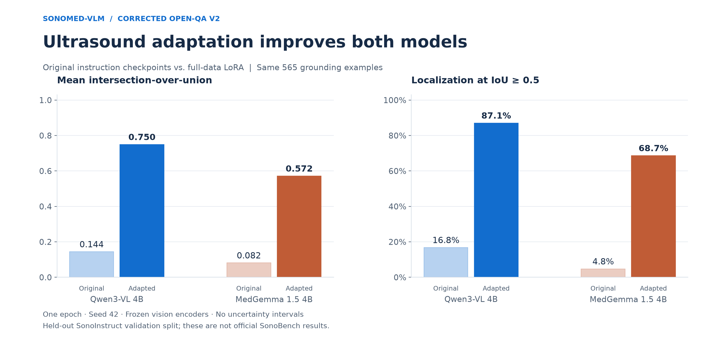
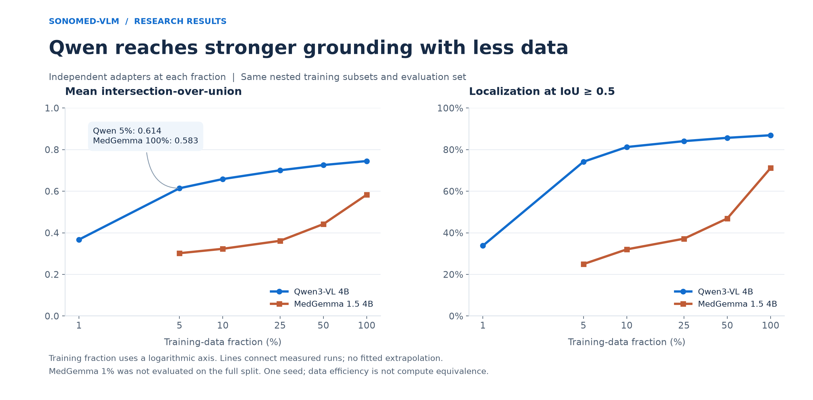
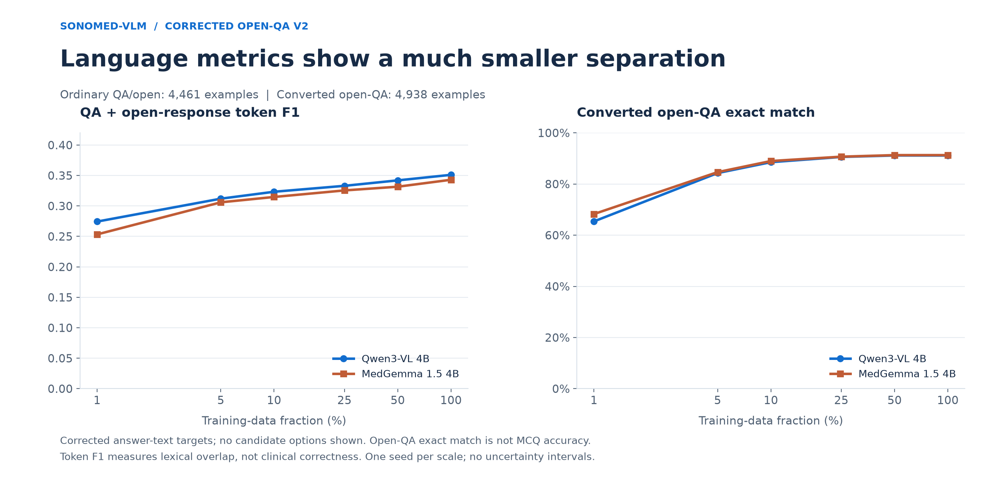
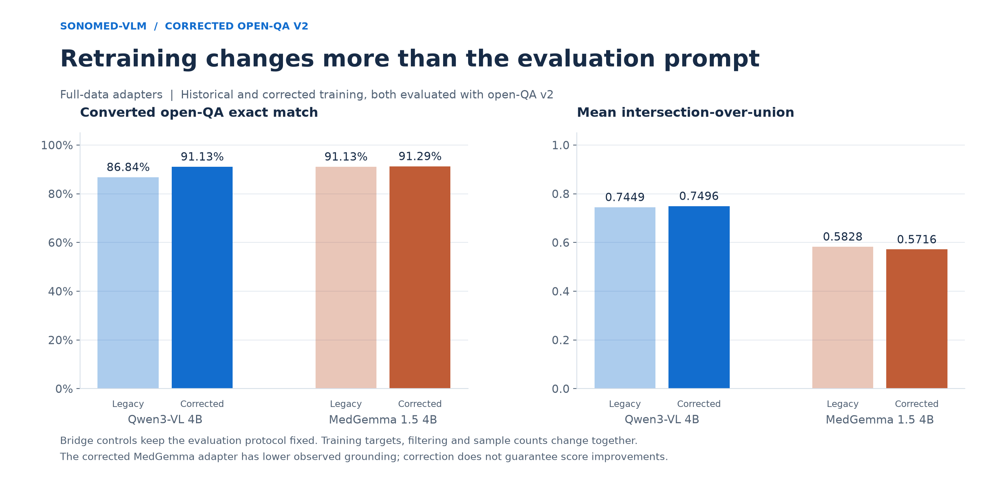

# Does medical specialization improve ultrasound adaptation?

**Corrected open-QA-v2 research report · 29 September 2026 · Single-seed empirical study**

## Research question

At a similar nominal model size, does a medically specialized vision-language model
provide better ultrasound adaptation and data efficiency than a general-purpose model
under the same decoder-LoRA recipe? Does the answer differ by grounding and language task?

We compare `Qwen/Qwen3-VL-4B-Instruct` and `google/medgemma-1.5-4b-it`.
“Original” means their released instruction-tuned checkpoints before our adaptation.
All 16 corrected cross-family evaluations completed. The tables below retain that
study; the separate same-Qwen intermediate-training pilot also completed and is
summarized under Interpretation, with a [dedicated report](MEDICAL_INTERMEDIATE_TRANSFER.md).

## Motivation and competing explanations


We began with MedGemma because medical specialization might provide useful clinical
knowledge and image representations. Our motivating concern was whether experience
with other medical modalities transfers to ultrasound's different appearance. A
strong general VLM might instead provide more useful spatial representations for
this specific adaptation task.

**This is a transfer hypothesis, not evidence that MedGemma overfit CT or MRI.**
Google describes broad medical text, question-answer and image training; CT/MRI are
among several modalities. Its public model card does not justify calling CT/MRI
the primary training data. We also cannot establish that Qwen never encountered
medical data. [Google model card](https://huggingface.co/google/medgemma-1.5-4b-it).

Three explanations remain compatible with our observations:

1. Medical specialization may help language knowledge without improving ultrasound localization.
2. General spatial pretraining may transfer well: Qwen3-VL explicitly trains on grounding
   and uses normalized 0–1000 coordinates, compatible with this task's output convention.
   This is a plausible explanation, not an ablation result.
   [Qwen3-VL technical report, §3.2.4](https://arxiv.org/html/2511.21631v1#S3.SS2.SSS4).
3. Architecture, visual token budgets, adapter capacity, native prompts, or optimization
   may explain the gap independently of medical specialization.

Qwen versus MedGemma changes all of these factors together. It does not identify
the causal effect of medical QA pretraining. A closer control is Gemma 3 4B versus
MedGemma, supplemented by controlled pretraining ablations if accessible.


## Corrected study design

The earlier experiment omitted candidate options while retaining letter-bearing targets
and option-aware scoring. The replacement protocol is deliberately **open-ended QA**:
no candidate answers, answer-text targets, and no predicted-letter lookup. Ambiguous or
choice-dependent records are excluded. Both models were retrained independently from
their original checkpoints at every fraction. This repairs training and evaluation;
it does not relabel old answer-matching scores as new accuracy.
[Full conversion specification](OPEN_QA_V2.md) · [Original audit](MCQ_PROMPT_AUDIT_20260927.md).

| Factor | Protocol |
|---|---|
| Full training | 187,761 retained SonoInstruct examples |
| Fractions, both models | 1%, 5%, 10%, 25%, 50%, 100% |
| Retained counts | 1,882 / 9,251 / 18,761 / 47,173 / 94,118 / 187,761 |
| Validation | 9,964: 4,938 converted open-QA; 4,461 ordinary QA/open; 565 grounding |
| Additional controls | Two original models; two historical full-data adapters under the new evaluation protocol |
| Optimization | One epoch, seed 42, AdamW, LR 1e-4, cosine, warmup 0.03, weight decay 0.01 |
| Effective batch | Eight: four GPUs × one example × two accumulation steps |
| Adapter | BF16, rank 16, alpha 32, dropout 0.05, decoder q/k/v/o and gate/up/down |
| Frozen components | Vision tower and multimodal projector |
| Generation | Greedy, maximum 256 new tokens, native chat templates |
| Qwen image budget | Native processor, maximum 1,048,576 pixels |
| Hardware | Four RTX PRO 6000 Blackwell GPUs per training run |

Filtering excludes 2,864 training and 134 validation records. The nominal fractions
refer to original nested, image-connected subsets, filtered without resampling.
Identical-image byte hashes prevent overlap under that definition; near duplicates,
shared patients and shared sources can remain. No patient/site-disjoint claim is made.
Both 1% results use full validation generation, not a smoke subset.

Training uses 33,030,144 adapter parameters for Qwen and 29,802,496 for MedGemma.
The common recipe does not equalize FLOPs, visual tokens, adapter capacity, or each
family's optimal hyperparameters. More data at one epoch means more updates.
Training loss is not a cross-tokenizer quality ranking.

## Original versus adapted models



| Model | Adaptation | Open-QA exact match | Open-QA token F1 | Ordinary QA F1 | Mean IoU | Loc@0.5 |
|---|---|---:|---:|---:|---:|---:|
| Qwen3-VL 4B | Original | 4.56% | 0.0948 | 0.1980 | 0.1444 | 16.81% |
| Qwen3-VL 4B | Corrected 100% | 91.13% | 0.9261 | 0.3511 | 0.7496 | 87.08% |
| MedGemma 1.5 4B | Original | 5.00% | 0.0808 | 0.1928 | 0.0815 | 4.78% |
| MedGemma 1.5 4B | Corrected 100% | 91.29% | 0.9273 | 0.3430 | 0.5716 | 68.67% |

At full data, Qwen reaches **0.7496 mean IoU versus 0.5716** for MedGemma:
an absolute difference of **0.1780**, or **31.14%** relative.
Localization@0.5 is **87.08% versus 68.67%**
(**18.41 percentage points**).
Qwen improves 5.19× over its original mean IoU;
MedGemma improves 7.01× over its lower baseline.
These are observed differences, not significance claims.

## Data scaling



| Data | Examples | Qwen IoU | MedGemma IoU | Qwen Loc@0.5 | MedGemma Loc@0.5 |
|---:|---:|---:|---:|---:|---:|
| 1% | 1,882 | 0.3857 | 0.1871 | 36.11% | 13.27% |
| 5% | 9,251 | 0.5989 | 0.3257 | 68.67% | 27.43% |
| 10% | 18,761 | 0.6745 | 0.3423 | 81.77% | 33.63% |
| 25% | 47,173 | 0.7007 | 0.3878 | 83.36% | 40.71% |
| 50% | 94,118 | 0.7374 | 0.4150 | 87.08% | 45.84% |
| 100% | 187,761 | 0.7496 | 0.5716 | 87.08% | 68.67% |

Qwen has higher observed IoU and Localization@0.5 at every matched fraction.
Qwen 5% exceeds full-data MedGemma on mean IoU (0.5989 vs. 0.5716), while their
Localization@0.5 is equal (68.67%, 388/565). The example-count ratio is
187,761/9,251 = 20.3, not an equal-compute comparison. Five percent is the first
tested Qwen fraction above that IoU endpoint; no interpolated threshold is claimed.

## Language results



At full data, converted open-QA exact match slightly favors MedGemma (91.29% vs.
91.13%), as does converted token F1 (0.9273 vs. 0.9261). Ordinary QA token F1 favors
Qwen (0.3511 vs. 0.3430). These small differences do not establish statistical
superiority, equivalence, or clinical quality. Qwen's grounding advantage is not
an across-the-board language advantage. Open-QA exact match is not MCQ accuracy.

## All 16 evaluations

| Model | Training | Open-QA EM | Open-QA F1 | Ordinary QA F1 | Mean IoU | Loc@0.5 |
|---|---|---:|---:|---:|---:|---:|
| Qwen3-VL 4B | Corrected 1% | 65.39% | 0.6650 | 0.2743 | 0.3857 | 36.11% |
| Qwen3-VL 4B | Corrected 5% | 84.29% | 0.8563 | 0.3119 | 0.5989 | 68.67% |
| Qwen3-VL 4B | Corrected 10% | 88.54% | 0.8994 | 0.3233 | 0.6745 | 81.77% |
| Qwen3-VL 4B | Corrected 25% | 90.58% | 0.9206 | 0.3330 | 0.7007 | 83.36% |
| Qwen3-VL 4B | Corrected 50% | 91.15% | 0.9257 | 0.3420 | 0.7374 | 87.08% |
| Qwen3-VL 4B | Corrected 100% | 91.13% | 0.9261 | 0.3511 | 0.7496 | 87.08% |
| Qwen3-VL 4B | Original | 4.56% | 0.0948 | 0.1980 | 0.1444 | 16.81% |
| Qwen3-VL 4B | Legacy 100% bridge | 86.84% | 0.8829 | 0.3483 | 0.7449 | 86.90% |
| MedGemma 1.5 4B | Corrected 1% | 68.27% | 0.6923 | 0.2533 | 0.1871 | 13.27% |
| MedGemma 1.5 4B | Corrected 5% | 84.65% | 0.8579 | 0.3060 | 0.3257 | 27.43% |
| MedGemma 1.5 4B | Corrected 10% | 88.98% | 0.9024 | 0.3147 | 0.3423 | 33.63% |
| MedGemma 1.5 4B | Corrected 25% | 90.68% | 0.9207 | 0.3255 | 0.3878 | 40.71% |
| MedGemma 1.5 4B | Corrected 50% | 91.29% | 0.9269 | 0.3316 | 0.4150 | 45.84% |
| MedGemma 1.5 4B | Corrected 100% | 91.29% | 0.9273 | 0.3430 | 0.5716 | 68.67% |
| MedGemma 1.5 4B | Original | 5.00% | 0.0808 | 0.1928 | 0.0815 | 4.78% |
| MedGemma 1.5 4B | Legacy 100% bridge | 91.13% | 0.9237 | 0.3440 | 0.5828 | 71.68% |

Every row uses the same corrected evaluation protocol. “Legacy 100% bridge” means
an old, uncorrected-training adapter evaluated under v2, not corrected retraining.
These two controls are excluded from the learning curves.



Under the same v2 evaluation, Qwen's corrected retraining raises open-QA exact match
from 86.84% to 91.13% and IoU from 0.7449 to 0.7496. MedGemma's exact match changes
from 91.13% to 91.29%, but IoU decreases from 0.5828 to 0.5716. A protocol correction
need not improve every score. Training targets, filtering and sample counts changed
together, so this bridge does not isolate their individual effects. V1 semantic
answer matching used a different task/scorer and must not be compared numerically
with v2 exact match as an accuracy gain. [V1 archive](../results/archive/README.md).

## Interpretation

Within this split and recipe, medical specialization was not sufficient to beat
Qwen on ultrasound grounding. This does not show that medical knowledge is useless,
that MedGemma overfit CT/MRI, or that Qwen wins on other medical tasks. The original
Qwen already grounded better, and the cross-family comparison cannot isolate why.

Our [controlled follow-up](MEDICAL_INTERMEDIATE_TRANSFER.md) starts from the same
Qwen checkpoint: direct ultrasound adaptation versus MedQA intermediate instruction
tuning versus token/update-matched general QA intermediate tuning. The selected
budget is a one-seed pilot (42), with 1%, 10%, and 100% downstream branches.
It tests additional medical training beyond Qwen's existing knowledge. All nine
pilot checkpoints and the final summary completed on 30 September 2026.

At full ultrasound data, direct / medical-first / general-first open-QA exact match
is **91.13% / 91.33% / 91.19%**; mean grounding IoU is **0.7496 / 0.7449 / 0.7437**.
Medical-first improves exact match over both controls at 10% and 100%, while direct
tuning has higher mean IoU at all three fractions. These are small, mixed observed
effects. The pilot does not demonstrate consistent overall benefit, statistical
equivalence, or a lack of medical understanding. One seed cannot estimate seed variance.
The [full report](MEDICAL_INTERMEDIATE_TRANSFER.md) includes all nine results,
medical/general diagnostics, matched-control limitations and source hashes.

## Related work and contribution


Jeong et al. compared medically adapted models with their parent models and found
that specialization did not consistently improve medical QA, including after
supervised fine-tuning. The broad question is therefore not new.
[The Limited Impact of Medical Adaptation of Large Language and Vision-Language Models](https://arxiv.org/abs/2411.08870).

The SonoInstruct authors already fine-tuned Qwen3-VL-2B and evaluated it on
SonoBench. Fine-tuning Qwen on this dataset alone is not our novelty claim.
[A multimodal instruction dataset and benchmark for ultrasound understanding](https://www.nature.com/articles/s41746-026-02930-w).

The contribution here is a reproducible, approximately size-matched **ultrasound
adaptation and data-scaling comparison**, separating grounding from language
metrics and documenting a consequential evaluation defect. A stronger research
claim requires the additional controls below. We make no first-in-the-literature
claim and do not present this repository as a completed causal study.


## Limitations and remaining experiments

| Limitation | Needed evidence |
|---|---|
| Cross-family confounding | Parent-family Gemma control and same-backbone intermediate-training contrast |
| One seed | Repeated seeds and paired/group-aware uncertainty |
| Internal validation used during development | Untouched external/source-disjoint evaluation |
| Different processors and capacity | Visual-token, adapter-capacity and compute controls |
| One fixed epoch/LR | Matched tuning budget and epoch/update sensitivity |
| Lexical reference matching | Expert-reviewed clinical correctness and hallucinations |

The missing-option/letter-target defect is addressed by the completed open-QA-v2
retraining. This does not turn the task into standard MCQ evaluation. Single-reference
matching can penalize valid synonyms; conversion heuristics still need clinical review.
None of these results are official SonoBench scores; its test package has not been evaluated.

## Reproducibility and provenance

[Aggregate JSON](../results/research_results.json) records all 16 run identifiers,
metric denominators, per-task/source/focus aggregates, and prediction-file SHA-256s.
[CSV](../results/research_results.csv) contains the headline metric columns.
The published files are byte-for-byte copies of the verified CRC summary outputs.
Raw prompts, references, images, checkpoints and private environments remain off GitHub.

- Qwen revision: `ebb281ec70b05090aa6165b016eac8ec08e71b17`
- MedGemma revision: `91850547d9f0b2fdd21aa7c5f4f3d1a8a52c243b`
- Validation manifest SHA-256: `ddfeb64ec6766d0475ac2f03148e6aa4d74383d0a849d548df420df62eb4e853`
- Run registry: [`configs/openqa_v2_runs.json`](../configs/openqa_v2_runs.json)
- Conversion audit: [`results/openqa_v2_audit.json`](../results/openqa_v2_audit.json)
- CRC output collection: `openqa-v2-20260927`; summary job `4079535`, completed 28 September 2026.

The aggregator verifies complete unique IDs, matching prompts/references/protocols/
generation settings, adapter identity for corrected training runs, and the frozen
validation manifest. It recomputes scores from raw generations rather than cached
score fields. Configs, metadata and raw prediction artifacts remain in CRC storage.

```bash
# After training/evaluation described in OPEN_QA_V2.md; no GPU inference here.
python scripts/summarize_open_qa.py \
  --outputs-root /path/to/openqa-v2-20260927 \
  --manifest data/manifests-openqa-v2/val.jsonl \
  --runs configs/openqa_v2_runs.json

# Publish the verified summary/results.json and .csv as results/research_results.*.
# Figures use only public aggregate metrics.
python -m pip install -e '.[viz]'
python scripts/plot_research_results.py
```

The historical exporter `build_research_results.py` is v1-only and refuses to
overwrite an existing v2 JSON. PNG, SVG and PDF figures are available in
[`docs/assets/research`](assets/research). The public Hugging Face adapter still
contains legacy v1 weights; corrected v2 weights have not been published there.
